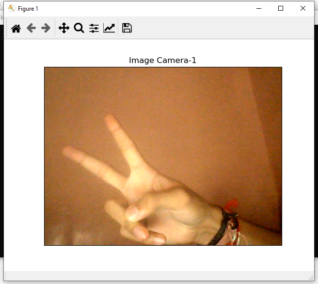
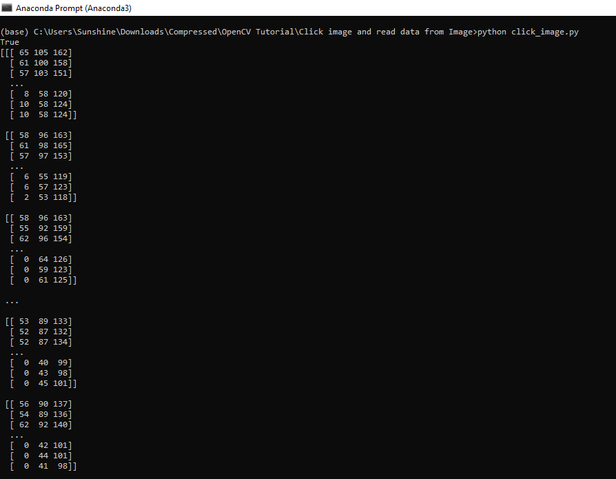

When we are going to start with OpenCV first we have to learn about :

1. How to open Web Cam using OpenCV
2. How to Capture image and read data from image.

Open Web-Cam
----------

Run command on CLI:

.. code-block:: text

    python open_webcam.py

Capture Image and Read data from captured image
----------

Run command on CLI:

.. code-block:: text

    python click_image.py
    
   

