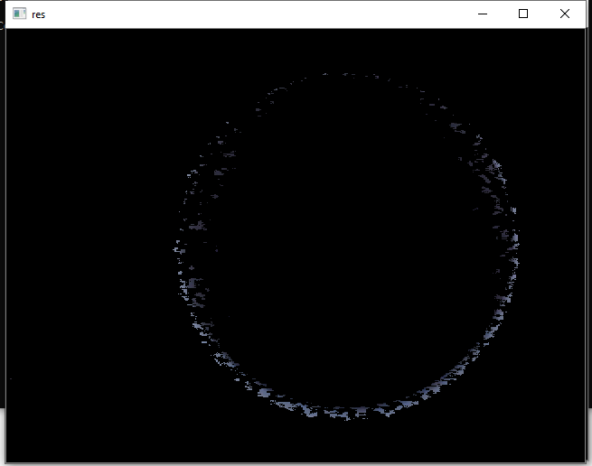

In this tutorial we will discuss upon the changing of colors i.e from BGR to gray or gray to BGR. 
There are a lot of flags we can use for changing color. We can capture image and then add a mask and then display the results here.

Run the following commmand :

.. code-block:: text

   python color.py
   
It will display three windows :
___________
* Real or Original Image
* Mask Image
* Resultant Image

