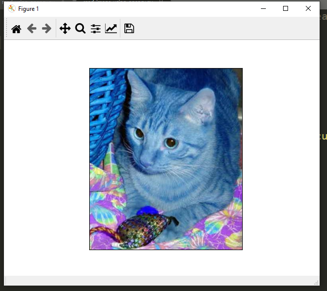

In this topic, I discussed about how to read images OpenCV. We can read these images colored, gray or unchanged by using fuctions of OpenCV.

These are the functions used for read images in different formats :
1. cv2.imread(image_name, cv2.IMREAD_COLOR) 
2. cv2.imread(image_name, cv2.IMREAD_GRAYSCALE) 
3. cv2.imread(image_name, cv2.IMREAD_UNCHANGED)

# Explaination :
_________________

* cv2.IMREAD_COLOR : Loads a color image. Any transparency of image will be neglected. It is the default flag.
* cv2.IMREAD_GRAYSCALE : Loads image in grayscale mode
* cv2.IMREAD_UNCHANGED : Loads image as such including alpha channel
____________________

**Fork this repo and do run this command :**

.. code-block:: text

    python read_image_using_opencv.py
    
    

